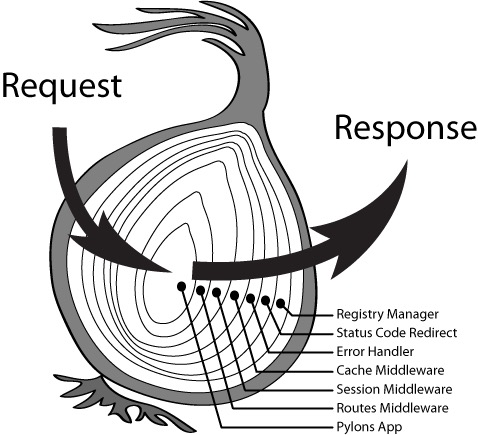

> Koa是基于Node.js的web框架，利用它可以很快搭建起一个http服务。本来是要利用它验证下http协议中某些细节问题，但是发现源码不多，就顺带看了下。

Koa作为一个第三方模块，对外仅暴露了 `Application`和`HttpError`。 我们仅讨论`Application`（`HttpError`实际为第三方模块，用于给Koa添加自定义的http错误处理方法）。

`Application`是一个`class`可看做Koa自身，先看下Koa实例上有哪些方法：


上面的这些方法除了`inspect`和`toJSON`这两个辅助方法外，其余方法都应用于web服务的运行。

## Koa程序流程

**requirements**
1. 利用node创建web服务，主要依靠`http`模块（https/http2类似）。需要了解下`http`模块的中`createServer`及`listen`方法的使用；

简单说下Koa创建web服务做的事情：创建一个http服务，监听系统分发到该服务上客户端请求并响应该请求。具体流程如下：

1. `http.createServer`创建一个http服务进程，这个方法接收一个函数作为有http请求时回调；
2. `app.callback` 组合middleware并返回了一个函数`fn`，这个函数`fn`处理http请求；
3. 当有http请求到达服务端时，在函数`fn`中调用`createContext`方法创建上下文`ctx`；
4. 将创建的上下文`ctx`交给middleware被compose后产生的函数`fn`处理， middleware里存放了我们所有的业务逻辑；

Koa提供的只有这个么一个流程架子，在web服务中经常用到的router，bodyparser，cookie等都交给了自定义的middleware处理。

而这个处理流程的抽象出来的模型就是Koa中总提到的**洋葱模型**。


## Koa洋葱模型解释

洋葱模型的实现靠的是koa-compose模块。 这是一个compose方法，koa-compose组合函数实现了处理流程的嵌套，我们先看一个不带嵌套的compose方法，对compose形成一个大概的概念。
``` js
// 接收多个函数作为参数，并返回一个新的函数
function compose(...fn){
    return  function(...args){
        var ret;
        // 依次执行每个函数
        for(var i=0; i < fn.length; i++){
            ret = fn[i].apply(this, args)
        }
        return ret;
    }
}
```

那么带嵌套的compose是什么意思？ 在Koa中，use方法用于注册一个middleware，其参数是一个函数`fn`。use方法把这些函数都存放到app.middleware中，最终利用koa-compose讲这些函数组合成一个新的函数。函数`fn`接收两个参数`ctx`和`next`，看官方图的示例：


可以看得出，next实际上是调用了下一个中间件。当下一个中间件执行完，在回到当前中间件，继续执行next()后面的语句。这样一来，就形成了中间件的嵌套。
``` js
function compose(...fn){
    if( fn.length === 0 ) return function(){}
    function dispatch(i){
        var next = i+1 < fn.length ? dispatch(i+1) : function(){}
        return function(ctx){
            fn[i]( ctx, function(){ next(ctx) })
        }
    }
    return dispatch( 0 )
}
```
根据源码简单解释下，嵌套的compose就是把要进行组合的若干的函数，可在未执行完时，先去执行后面的函数，等后面的函数执行完毕，再继续执行后续未执行的部分。


而Koa使用的koa-compose，不仅支持了嵌套，还支持异步。把每一个函数的都变成异步函数然后通过`then`方法链接起来。

```js
function compose(...fn){
    if( fn.length === 0 ) return Promise.resolve();
    function dispatch(i){
        var next = i+1 < fn.length ? dispatch(i+1) : function(){}
        return new Promise(function(resolve, reject){
            function(ctx){
                fn[i]( ctx, function(){ next(ctx)  })
            }
        })
    }
    return dispatch( 0 )
}
```

至此应该已经理解洋葱模型了，它本质上是解决问题的一种固定模式。如果不理解，以Koa中间件的写法为例，可简单粗暴的理解为，洋葱左半部分的是`next()`方法之前的处理流程，右半部分为`next()`之后的处理流程。

也可以把http请求当成一个流stream，每个中间件都有两个门，一个进来的门，一个出去的门。如果一个中间件中存在`next()`，则意味着在两个门之间又调用了其它中间件。
不过`next()`语句的位置也很值得玩味。在中间件中：
1. 如果`next()`的位置都出在函数最后，则这些中间件可以理解为顺序执行；
2. 如果`next()`都处在函数最前面，则这些中间件按注册顺序倒序执行；
3. 如果`next()`都在函数中间，则这些中间件构成一个典型的洋葱模型；



### Koa洋葱模型解决的问题
首先考虑下，如果不使用Koa目前的这种方式，有什么其它方法可以更好地扩展机制用来处理客户端发来的请求。

我们问题的场景：
> 我们基于node的`http.createServer(callback)`创建了一个http服务，用于监听客户端发来的请求request，其中callback用于处理request并作出response。也就是说所有的处理逻辑都在这个callback中。OK，我们的问题就是把路由、登录状态、日志、数据查询等逻辑组合到这个callback中。那么你会怎么处理呢？？


我总结下下来的koa使用洋葱模型的好处：
1. 利用`Promise.then`处理异步，实现多个异步中间件的有序执行（实际上，是将所有的中间件改为异步并通过`then`方法一个个串联起来）；
2. 中间件机制为程序处理http请求，提供了更加便捷的扩展方式；
3. 支持异步程序的同步写法，更便于不同逻辑间的组合；


## Promise与Generator及async/await

1. Promise ----> ES6/ES2015
2. Generator ----> ES7/ES2016
3. async/await ----> ES8/ES2017

### Generator 转 async/await
有一个generator函数 `g`如下：
``` js
function* g(start){
    var x = yield start+1;
    var y = yield x+2;
    return y;
}
```
Generator函数返回的结果和用法不再赘述。我们的目的是要把这个转成async/await， 也就意味不需要我们手动调用next方法就可以获得结果。所以需要有自动调用next方法的机制。

``` js
function co(fn, ...args) {
    var g = fn.apply(this, args);

    return new Promise(function (resolve, reject) {
        function step(ret) {
            var result = g.next(ret);
            if (result.done) {
                return resolve(result.value)
            } else if( result.value.next){
                result.value.then( step )
            } else {
                step( result.value)
            }
        }
        step()
    });
}
```

## ~~delegate Node原生 request/response~~
`Object.defineProperty`/`__defineGetter__`/`__defineSetter__`的关系


## node request中的socket
`request.socket`指向底层套接字， 网络中进程进行通信的一种机制。相对应的就有本地进程进行通信的机制（IPC，共享内存）。


## HTTP协议相关
### headersSent
存在于node.js  response 上，布尔值（只读）。 如果已发送响应头，则为 true，否则为 false。这个涉及到http协议中数据发送流程的细节。

### vary是什么
> The "Vary" header field in a response describes what parts of a request message, aside from the method, Host header field, and request target, might influence the origin server's process for selecting and representing this response.

可以说vary为客户端提供了明确告知服务端不需要使用缓存的机制（通过指定哪些header变化会导致服务端重新提供响应内容）。
更多信息参考[http spec(7.1.4.  Vary)](https://tools.ietf.org/html/rfc7231#section-7.1.4) 和 [Best Practices for Using the Vary Header](https://www.fastly.com/blog/best-practices-using-vary-header)

### http响应body为空的三个c890-/kiode码
- 204: 只需知道响应是否成功，不跳转
- 205: 清空当前页面html中所有的表单元素；
- 304: 缓存可用，无需返回新的内容；


### proxy 与 X-Forwarded-Host
`X-Forwarded-Host`：请求的源头服务器，当有代理服务器介入时，代理可能会导致原有的客户端信息丢失，可以使用此字段存储原始信息。


### http/2 
#### Koa支持 http/2的方式
To implement this and just use `app.callback`.
``` js
const fs = require('fs');
const http2 = require('http2');
const Koa = require('koa');

const app = new Koa();

app.use(ctx => {
  ctx.body = 'Hello Koa'; // or any other stream
});

const options = {
  key: fs.readFileSync('xxx.key'),
  cert: fs.readFileSync('xxx.crt'),
};
const server = http2.createSecureServer(options, app.callback());

server.listen(443);
```
#### Status message
http/2不允许自定义status message，意味着每个规范中的code值都有固定的description。
#### 伪头部字段

HTTP/1.x 使用消息开始行（RFC7230 Section 3.1）传递**目标URL**，**请求方法**，**响应状态码**等信息。HTTP/2使用特殊的以":"开始的伪头部字段来达到这个目的。不属于常规HTTP头部字段，不允许终端自己产生，只允许规范中所定义的5个：
- :method
- :path
- :scheme
- :authority
- :status


## try catch在什么情况下会比较明显的影响到性能
V8很早已经对`try catch`做了性能优化（TurboFan，随 Chrome 59 发布），影响基本可以忽略不计。
[V8: Behind the Scenes (November Edition feat. Ignition+TurboFan and ES2015)](https://benediktmeurer.de/2016/11/25/v8-behind-the-scenes-november-edition)


根据ECMA文档可知，`try catch`性能消耗主要原因在于对当前词法作用域的额外拷贝，这个过程是跟业务无关的，必然会或多或少牺牲掉部分性能。

